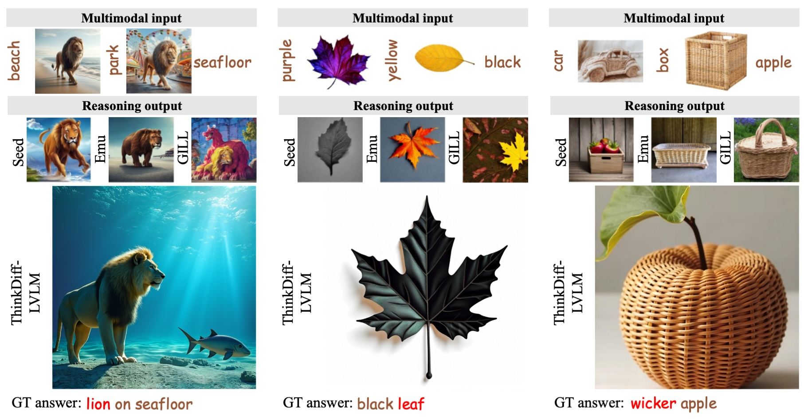

<p align="center">
  
</p>

# I Think, Therefore I Diffuse: Enabling Multimodal In-Context Reasoning in Diffusion Models

[Zhenxing Mi](https://mizhenxing.github.io)$^1$, [Kuan-Chieh Wang](https://wangkua1.github.io)$^2$, [Guocheng Qian](https://guochengqian.github.io)$^2$, [Hanrong Ye](https://sites.google.com/site/yhrspace)$^1$, [Runtao Liu](https://github.com/rt219)$^1$, [Sergey Tulyakov](https://stulyakov.com)$^2$, [Kfir Aberman](https://kfiraberman.github.io)$^2$, [Dan Xu](https://www.danxurgb.net)$^1$


$^1\text{HKUST}$, $^2\text{Snap Inc.}$

### [Arxiv](https://arxiv.org/abs/2502.10458) | [Project Page](https://mizhenxing.github.io/ThinkDiff)


## TL;DR

* Aligning VLM to an **LLM** decoder, instead of a **diffusion** decoder.
* It's based on the finding that the LLM decoder shares the same input space with the diffusion decoder.
* ThinkDiff-LVLM aligns deep features of LVLM's **generated** tokens, instead of deep features of LVLM's **input** tokens, to the decoders.
* This transfers the reasoning capabilities to diffusion decoders. (**generated** tokens are answers while **input** tokens are only questions.)

## Introduction


This paper presents **ThinkDiff**, a novel alignment paradigm that enables multimodal in-context understanding and reasoning capabilities in text-to-image diffusion models by integrating the capabilities of vision-language models (VLMs). Directly aligning VLMs with diffusion decoders via diffusion loss requires complex and costly reasoning-based data pairs with multimodal inputs and image outputs. Instead, ThinkDiff leverages vision-language training as a proxy task, aligning VLMs to a large language model (LLM) decoder. This proxy task is feasible because the LLM **decoder** shares the same input feature space as diffusion **decoders** that use the corresponding LLM **encoder** for text embedding. As a result, alignment with diffusion decoders can be achieved by alignment with the LLM decoder. ThinkDiff effectively transfers multimodal in-context understanding and reasoning capabilities from VLMs to diffusion models, eliminating the need for complex reasoning-based multimodal datasets by using only readily available image-text pairs for training. Experiment results demonstrate that ThinkDiff significantly improves performance on the challenging CoBSAT benchmark for multimodal in-context reasoning generation, raising the best accuracy from 19.2% to 46.3%, with only 5 hours of training on 4 A100 GPUs. 

## 🌟Multimodal in-conetxt reseasoning generation




## Multimodal in-conetxt composition

### 🌟Single image + text for video

[🌟Click here🌟 for the videos!](https://mizhenxing.github.io/ThinkDiff/#for_video)


### 🌟Single image + text


### 🌟Two images


### 🌟Two images + text


### More results are in the [Project Page](https://mizhenxing.github.io/ThinkDiff)!

## Citation

```bibtex
@article{mi2025thinkdiff,
  title={I Think, Therefore I Diffuse: Enabling Multimodal In-Context Reasoning in Diffusion Models},
  author={Mi, Zhenxing and Wang, Kuan-Chieh and Qian, Guocheng and Ye, Hanrong and Liu, Runtao and Tulyakov, Sergey and Aberman, Kfir and Xu, Dan},
  journal={arXiv preprint arXiv:2502.10458},
  year={2025}
}
```
